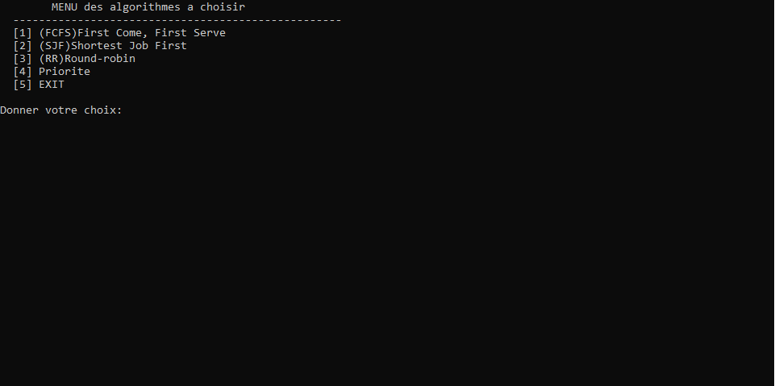
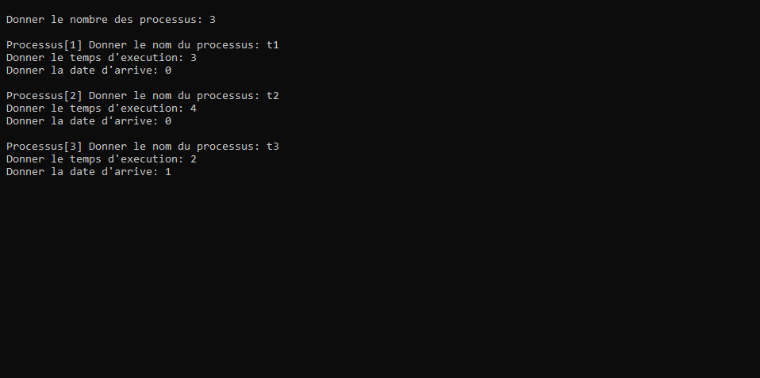
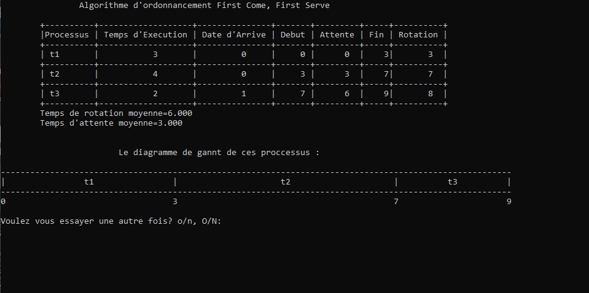
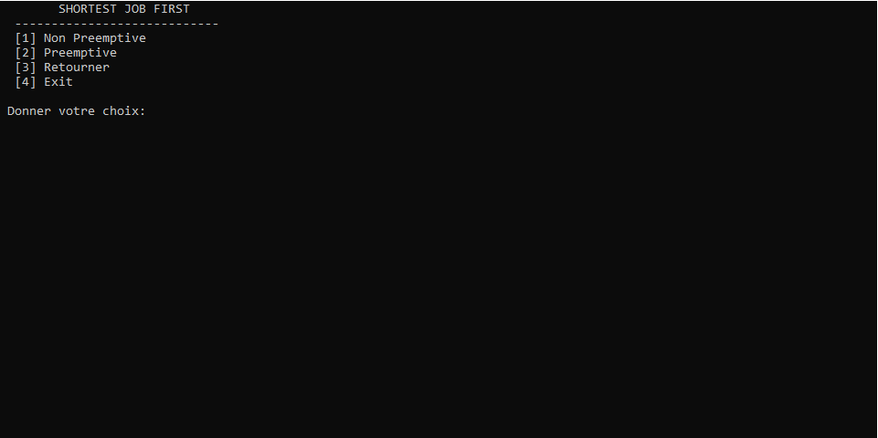
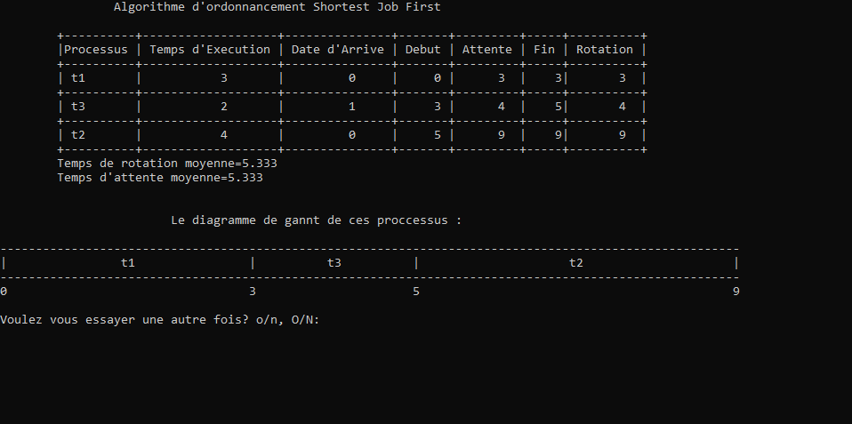
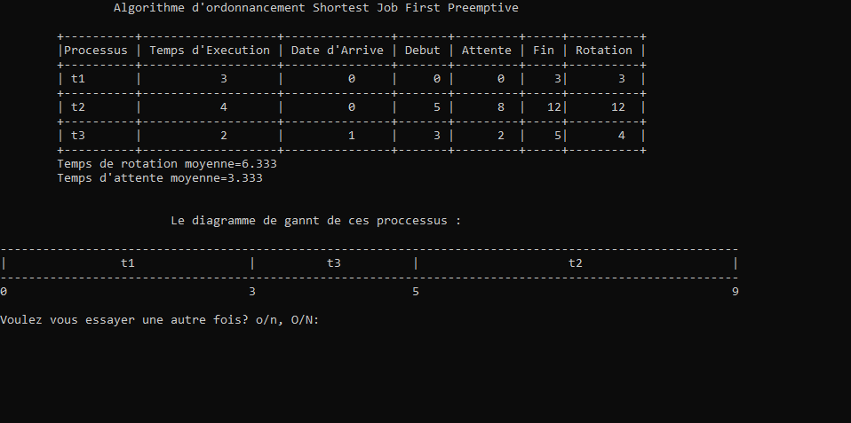
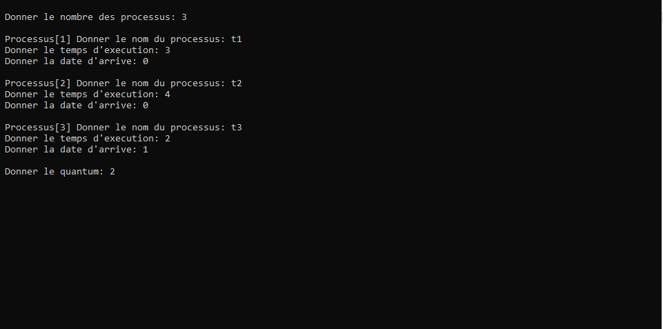
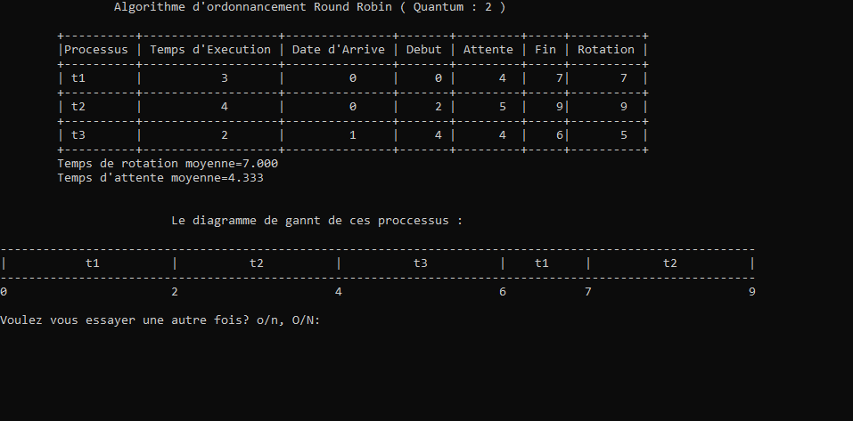
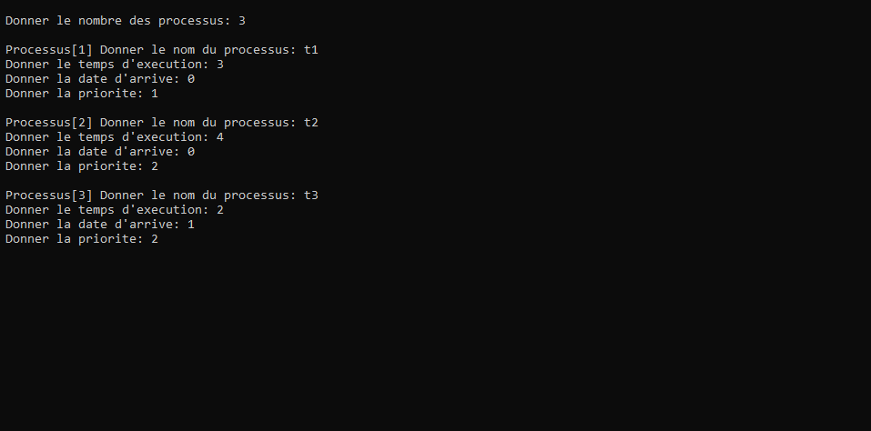
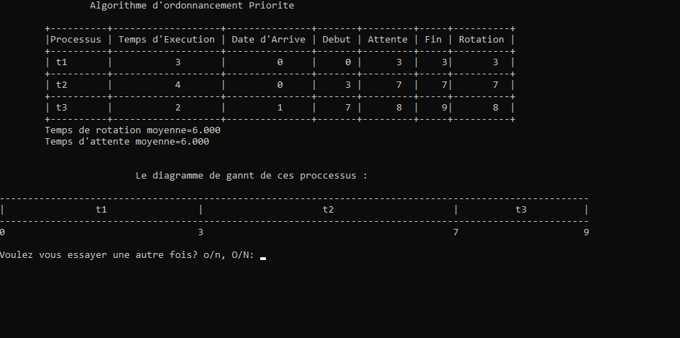

# CPU Scheduling Algorithms in C
This project consists of CPU scheduling algorithms implemented in C programming language. It includes various algorithms such as FCFS (First Come, First Serve), SJF (Shortest Job First), RR (Round-robin), and Priority-based scheduling.

## Overview
The project contains the following files:

- `cpu_scheduling.c`: Contains the main implementation of CPU scheduling algorithms.
- `README.md`: This file, providing an overview of the project.
- Other supporting files related to the project's functionalities.
## Implemented Algorithms
1. **FCFS (First Come, First Serve):** Implements the FCFS scheduling algorithm where processes are executed based on their arrival time.
2. **SJF (Shortest Job First):**
- **Non-preemptive:** Executes the shortest job first without preemption.
- **Preemptive**: Executes the shortest job first with preemption.
3. **RR (Round-robin):** Implements the round-robin scheduling algorithm allowing a fixed time quantum for each process.
4. **Priority-based Scheduling:**
- **Non-preemptive:** Executes processes based on priority without preemption.
- **Preemptive** Executes processes based on priority with preemption.
## Usage
To run the program:

1. Compile the `cpu_scheduling.c` file using a C compiler.
2. Execute the compiled binary file.
How to Run
Clone the repository.
Compile the C file using a C compiler such as GCC: `gcc cpu_scheduling.c -o cpu_scheduling`
Run the compiled program: `./cpu_scheduling`
## Screenshots
 
### FCFS Execution

### SJF Execution
  

### RR Execution
  

### Priority Scheduling Execution
  
## Credits

This project was developed by:
- [Mohamed Louay Saidi](https://github.com/MohamedLouaySaidi)
- [Syrine Meksi](https://github.com/MeksiSyrine)
